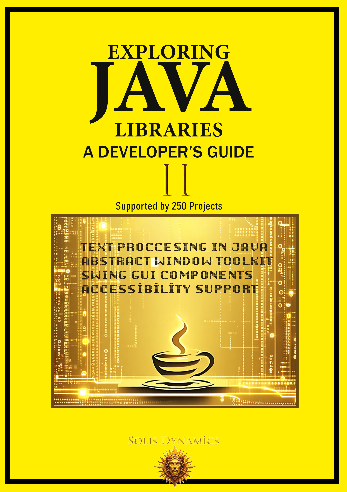

<div align="center">
  

  # Exploring Java Libraries: A Developer’s Guide (Volume II)
  ### Advanced Text Processing, AWT, Swing GUI, and Accessibility in Java

  [](https://www.oracle.com/java/)
  [](https://opensource.org/licenses/MIT)
  [](https://github.com/SolisDynamics)
  [](#)
</div>

---
# Exploring Java Libraries – Volume II  
### Free Code Examples & Companion Resources

Practical Java examples for **text processing, desktop GUI development, and accessibility**, designed for developers who want to move beyond theory.

---

## About This Repository

This repository contains **selected code examples and companion resources** for:

**_Exploring Java Libraries: A Developer’s Guide (Volume II)_**  

Unlike traditional API references, this material focuses on **real usage scenarios**, helping you understand how Java’s standard libraries are applied in actual software development.

While Volume I focused on the core infrastructure and backend systems, **Volume II** is dedicated to the visual, interactive, and inclusive aspects of Java. This repository contains curated, production-ready code examples, UI projects, and structural blueprints to help developers master desktop application architecture, text localization, and accessibility standards.

---

## What This Repository Includes

- Core examples from `java.text`
- AWT graphical programming samples  
- Swing-based desktop UI implementations  
- Accessibility API demonstrations  
- Practical, developer-focused Java patterns  
- Mini-project style examples for hands-on learning  

---

## Repository Structure

```text
exploring-java-libraries-2/
├── assets/                 # Book cover, UI screenshots, and diagrams
├── examples/               # Isolated code snippets categorized by package
│   ├── ch01_text/          # java.text examples (DateFormat, MessageFormat)
│   ├── ch02_awt/           # Graphics2D, Layouts, and AWT components
│   ├── ch03_swing/         # JTables, JTrees, Custom Models, and Events
│   └── ch04_access/        # AccessibleContext implementations
├── projects/               # Complete, runable GUI mini-applications
├── docs/                   # Additional setup notes and UI guidelines
├── .gitignore              # Java compilation exclusions
├── LICENSE                 # MIT License details
└── README.md               # This documentation
```

---

## What You Will Learn

### ✔ Advanced Text Processing (`java.text`)
- Formatting and parsing  
- Localization (i18n / l10n)  
- Character iteration  
- Locale-aware data handling  

### ✔ AWT (Abstract Window Toolkit)
- Graphics and rendering  
- Layout managers  
- Event-driven programming  
- Fonts and geometry  

### ✔ Swing GUI Development
- Components and containers  
- Tables, menus, and inputs  
- Layout and styling  
- Event handling and UI architecture  

### ✔ Accessibility (`javax.accessibility`)
- Building inclusive applications  
- Supporting assistive technologies  
- Improving usability and compliance  

---

## Get the Full Book
Take the next step and unlock the complete structured guide:
* **🔗Gumroad:** https://solisdynamics.gumroad.com/l/java-libraries-guide-2
* **🔗Leanpub:** https://leanpub.com/java-libraries-guide-2

Move beyond examples and start building real-world Java applications.

---

## About the Book

**Exploring Java Libraries: A Developer’s Guide (Volume II)** focuses on:

- `java.text` (advanced text processing)
- AWT (low-level GUI systems)
- Swing (modern desktop UI development)
- Accessibility APIs

The book is built around:

- Structured explanations  
- Real-world coding scenarios  
- Method-level breakdowns  
- Practical execution outputs  

This is not just documentation — it is a **hands-on roadmap to mastering Java libraries**.

---

## Who This Is For

- Intermediate → Advanced Java developers  
- Software engineering students  
- Desktop application developers  
- Developers who want **practical mastery, not theory**  

---

## Technical Scope & Covered Packages

This repository is strictly organized to reflect the structured learning approach of the book. Every major library discussed in the guide has corresponding executable code here.

| Domain | Core Packages | Description |
| :--- | :--- | :--- |
| **Advanced Text Processing** | `java.text` | Formatting, parsing, string manipulation, Collation, and complex Internationalization (i18n) / Localization (l10n). |
| **Abstract Window Toolkit** | `java.awt`, `java.awt.geom`, `java.awt.event` | Low-level graphical programming, geometry, color models, fonts, layout managers, and foundational event delegation. |
| **Modern Desktop GUI** | `javax.swing`, `javax.swing.table`, `javax.swing.text` | Advanced components, MVC architecture in Swing, Look & Feel implementations, table models, and rich text editors. |
| **Inclusive Architecture** | `javax.accessibility` | Implementing the Java Accessibility API (JAAPI) for screen readers, assistive technologies, and inclusive UI design. |

---

## About the Author

**Solis Dynamics**  
Technical publishing focused on practical, structured, and real-world software development knowledge.

---

## Contact

**solisdynamicscontact@gmail.com**

---

## License

This repository is intended for **educational and promotional use**.

---
